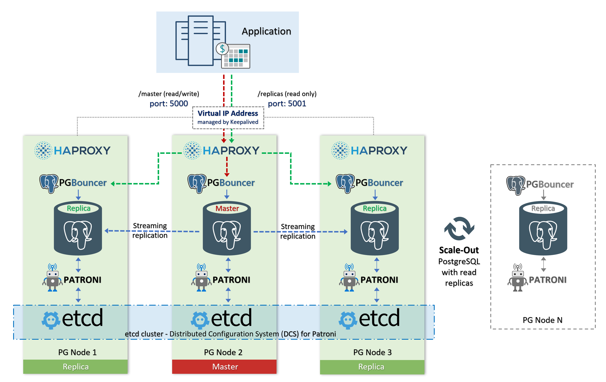

## Ansible role Patroni

This role allows to deploy this architecture :

This architecture provides the ability to distribute the load on reading. This also allows us to scale out the cluster (with read-only replicas).

* **Port 5000** (read / write) master ;
* **Port 5001** (read only) all replicas ;

The `synchronous_mode` is set to `true` :
* **Port 5002** (read only) synchronous replica only ;
* **Port 5003** (read only) asynchronous replicas only ;

### Components of high availability

* **Patroni** is a template for you to create your own customized, high-availability solution using Python and - for maximum accessibility - a distributed configuration store like ZooKeeper, etcd, Consul or Kubernetes. Used for automate the management of PostgreSQL instances and auto failover ;
* **etcd** is a distributed reliable key-value store for the most critical data of a distributed system. etcd is written in Go and uses the Raft consensus algorithm to manage a highly-available replicated log. It is used by Patroni to store information about the status of the cluster and PostgreSQL configuration parameters ;

### Components of load balancing

* **HAProxy** is a free, very fast and reliable solution offering high availability, load balancing, and proxying for TCP and HTTP-based applications ;
* **confd** manage local application configuration files using templates and data from etcd or consul. Used to automate HAProxy configuration file management ;
* **Keepalived** provides a virtual high-available IP address (VIP) and single entry point for databases access. Implementing VRRP (Virtual Router Redundancy Protocol) for Linux. In our configuration keepalived checks the status of the HAProxy service and in case of a failure delegates the VIP to another server in the cluster ;
* **PgBouncer** is a connection pooler for PostgreSQL ;

### Ports list

List of TCP ports open for the database cluster :
* **PostgreSQL :** 5432
* **PGBouncer :** 6432
* **Patroni REST API :** 8008
* **etcd :** 2379, 2380
* **HAProxy master read/write :** 5000
* **HAProxy replicas read only :** 5001
* **HAProxy synchronous replicas only :** 5002
* **HAProxy asynchronous replicas only :** 5003
* **HAProxy statistics :** 7000
